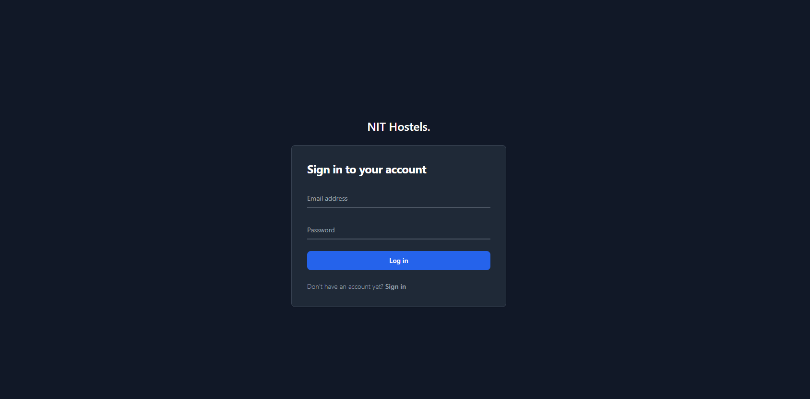
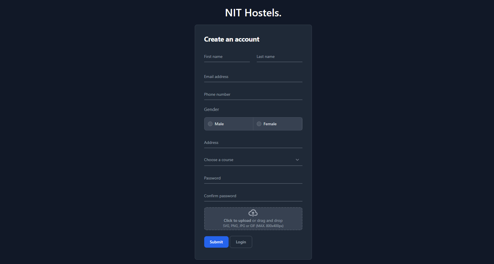
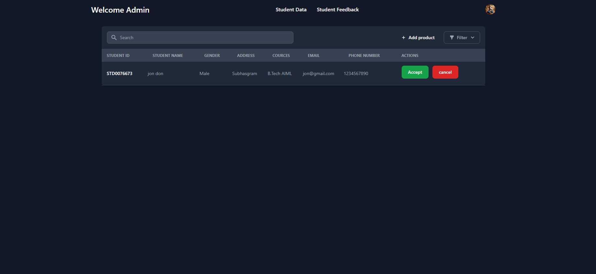
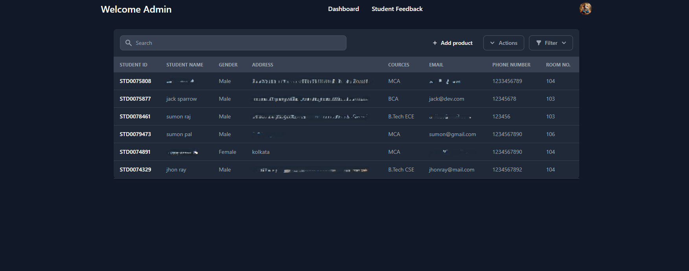
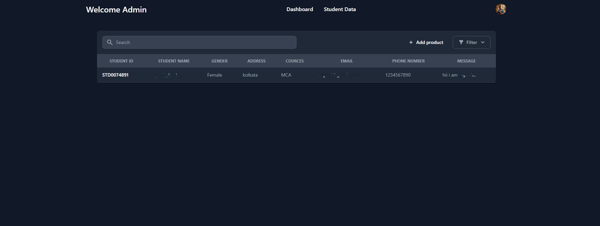
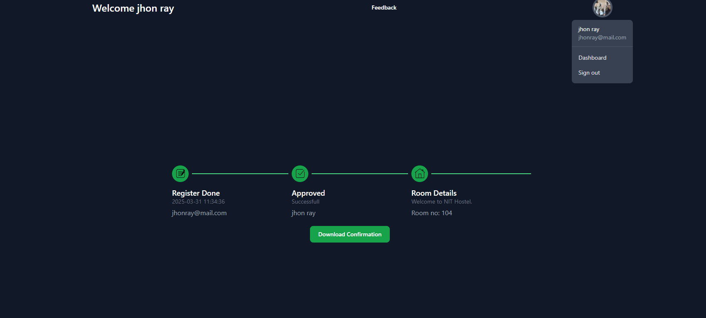
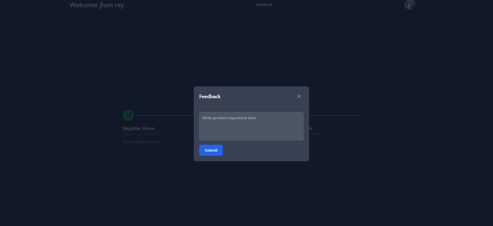
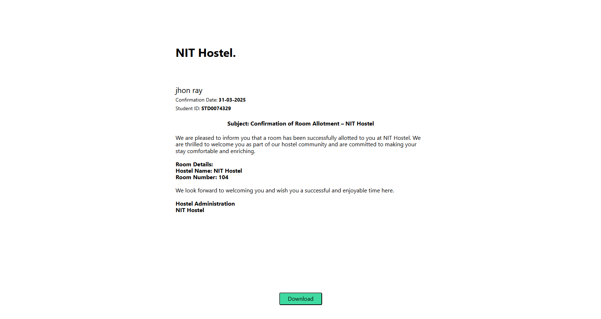

# Hostel Management System

## 📌 Project Overview
The **Hostel Management System** is a web-based application designed to streamline the process of room allocation in hostels. It is developed using **HTML, Tailwind CSS, jQuery, AJAX, PHP, phpMailer and MySQL**. The system features two types of user roles:
- **Admin**: Manages student registrations and allocates rooms.
- **Student**: Registers for a room and downloads the allocated room letter.

---

## 🚀 Features
### 🔹 **Authentication System**
- Secure login for **Admin** and **Students**.
- Students can register and log in to request a hostel room.
- Admin can log in to manage student requests and allocate rooms.

### 🔹 **Student Dashboard**
- Submit room request.
- View allocated room number.
- Download the **Room Allocation Letter** once the admin assigns a room.

### 🔹 **Admin Dashboard**
- View list of registered students.
- Allocate hostel rooms to students.
- Update and manage room allocations.
- Ensure only one room is assigned per student.

### 🔹 **Room Allocation System**
- Students can request a room from the available slots.
- Admin manually assigns a room to each student.
- Once allocated, the student can view the **room number** and download the **allocation letter**.

### 🔹 **Mail send**
- Register sccessfull then mail send
- Room allocate then mail send to student

### 🔹 **AJAX-based Dynamic Updates**
- Room requests and allocations are processed without page refresh.
- Students get real-time updates on their room allocation status.

### 🔹 **Responsive UI with Tailwind CSS**
- Fully responsive and mobile-friendly interface.
- Clean and minimal UI for better user experience.

---

## 🛠️ Technologies Used
- **Frontend:** HTML, Tailwind CSS, jQuery
- **Backend:** PHP, phpMailer, MySQL
- **AJAX:** Used for seamless, dynamic data updates

---

## 📷 Screenshots
_(Attach relevant screenshots here to showcase login, student dashboard, admin panel, and allocation system.)_
,
,
,
,
,
,
,
,

---

## 📂 Folder Structure
```bash
HMS/
│── .git/                # Git repository (if version-controlled)
│── .vscode/             # VS Code settings (if applicable)
│── config/              # Configuration files
│── db/                  # Database-related files
│── HMS send/            # Additional storage for sending data
│── img/                 # Image assets
│── upload/              # Uploads folder
│── upload1/             # Another upload directory
│── web/                 # Core application files
│   ├── approve.php      # Admin approves student room allocation
│   ├── authuser.php     # Authentication handling
│   ├── dashboard.php    # Admin dashboard
│   ├── delete.php       # Delete functionality
│   ├── dropdown_value.php  # Fetch dropdown values dynamically
│   ├── feedback.php     # Student feedback submission
│   ├── feedback_data_show.php # Display feedback data
│   ├── generate-pdf.js  # Generate PDF for room allocation
│   ├── hostel-management-system.sql # Database dump
│   ├── index.html       # Landing page
│   ├── indexinvoice.php # Invoice management
│   ├── invoice-pdf.css  # PDF styles
│   ├── invoice.css      # Invoice styles
│   ├── invoice.php      # Invoice generation
│   ├── jquery.min.js    # jQuery library
│   ├── login.php        # Student/Admin login
│   ├── login_check.php  # Login validation
│   ├── logout.php       # Logout functionality
│   ├── pdf_make.php     # PDF generation
│   ├── show_data.php    # Display student data
│   ├── signup.php       # Student registration
│   ├── signup_check.php # Signup validation
│   ├── student_dashboard.php  # Student dashboard
│   ├── student_dashboard_check.php  # Dashboard authentication
│   ├── student_data.php  # Student records
│   ├── student_data_show.php  # Show student details
│   ├── studentauth.php   # Student authentication
│   ├── Readme.md        # Documentation
```

---

## 🔧 Installation Guide
### **1️⃣ Clone the Repository**
```sh
git clone https://github.com/santanu0101/hostel-management-system.git
```

### **2️⃣ Setup Database**
- Create a **MySQL database**.
- Import `db/schema.sql` into your database.
- Configure database credentials in `config.php`.

### **3️⃣ Start Development Server with Laragon**
- Download and install **Laragon** from [https://laragon.org/](https://laragon.org/).
- Place the project inside the `C:\laragon\www\hostel-management-system` directory.
- Start Laragon and enable Apache and MySQL.
- Access the project at `http://localhost/hostel-management-system/`.

---

## 🔐 Authentication Flow
1. **Student Registration**
   - Students register using their details.
   - Login with registered credentials.
   
2. **Admin Login**
   - Admin logs in to view student requests.
   - Allocates rooms to students.
   
3. **Room Allocation**
   - Once a room is assigned, students can view their room details.
   - Download the allocation letter from their dashboard.

4. **Mail Send**
   - Register sccessfull then mail send
   - Room allocate then mail send to student
---

## 📜 License
This project is **open-source** and can be modified or extended based on requirements.

---

## 📞 Contact
For any queries or contributions, feel free to reach out:
- **Email:** [My Email](santanuraj75@mail.com)
- **GitHub:** [santanu0101](https://github.com/santanu0101)

---

_Enjoy developing and managing hostel rooms efficiently! 🚀_


